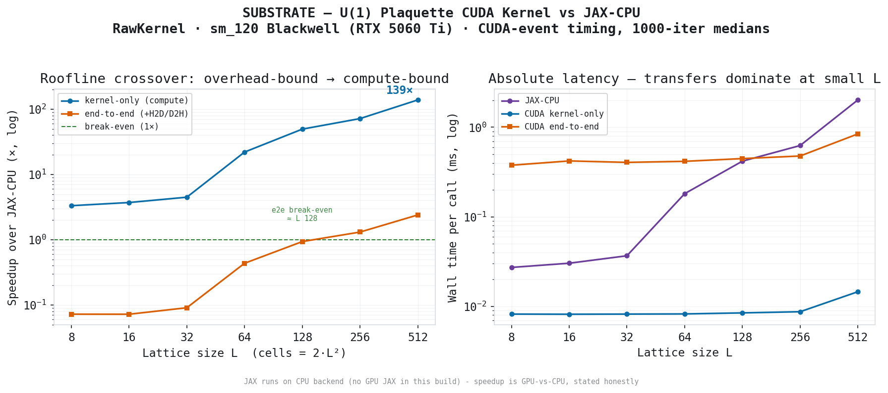
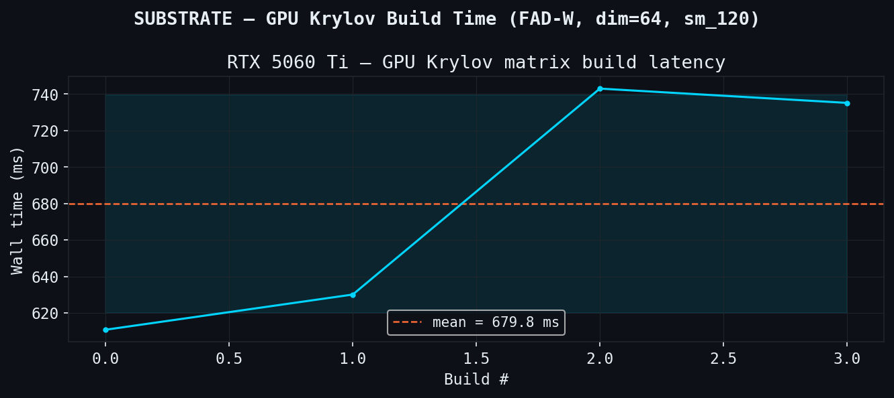
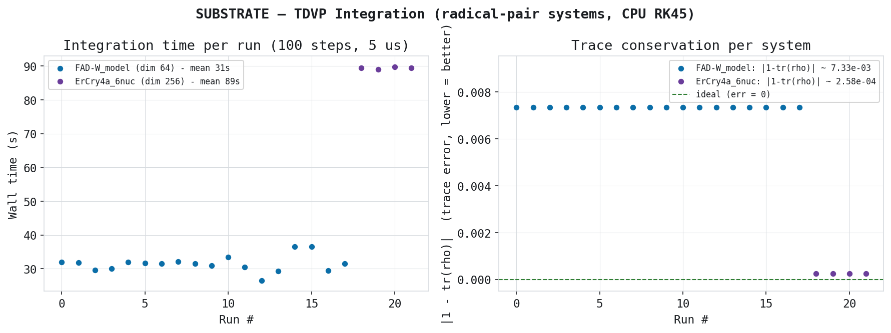
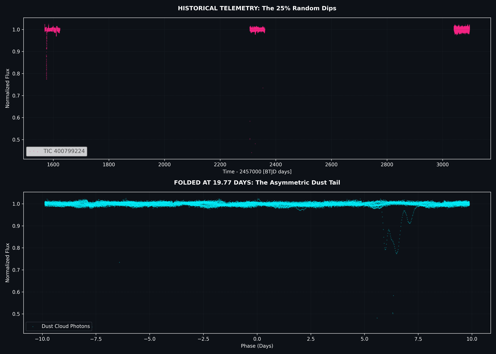
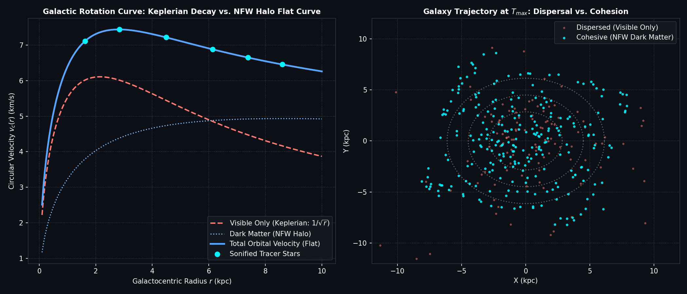

# SUBSTRATE

> *From quantum vacuum to geomagnetic civilization risk — a multi-scale computational framework.*

SUBSTRATE is a unified research platform analyzing electromagnetic fields across all physical scales:
from quantum field theory and quantum biological sensing, through geomagnetic dynamics and solar physics,
to cosmological structure.

## The thesis

At every scale, the same question: **what is the substrate generating the observable pattern?**

- Quantum vacuum fluctuations → fields → forces
- Radical pair coherence → biological magnetoreception
- Geomagnetic field → civilizational protection layer
- Heliospheric dynamics → cosmic ray modulation
- CMB fluctuations → large-scale structure
- Neural state (EEG) → physical parameter modulation ← KHAOS bridge

## Measured, across scales (RTX 5060 Ti, sm_120)

Each figure comes from the module's own benchmark/analysis pipeline
(`benchmarks/plot_benchmarks.py`, `modules/*/`) — real data, honest baselines.

**Compute — U(1) lattice gauge: a hand-written CUDA plaquette kernel vs JAX-CPU.**
The kernel crosses from overhead-bound to compute-bound; *kernel-only* reaches ~139× at
L=512, while *end-to-end* (with H2D/D2H transfers) only breaks even near L≈128 — stated
honestly, since JAX runs on its CPU backend here (GPU-vs-CPU, not GPU-vs-GPU):



**Quantum biology — radical-pair dynamics (FAD-W, ErCry4a) on the GPU.** TDVP integration
is trace-conserving (|1−tr ρ| tracked, right); the GPU Krylov matrix build runs in ~680 ms
at dim 64 (left):

| | |
|:---:|:---:|
|  |  |

**Geomagnetic — dipole-moment (VADM) forecast: the civilizational protection layer.**
An LSTM ensemble (N=50, MC-Dropout) with a 90% prediction interval, against the Sint-2000
record and the Laschamp-excursion threshold:

**Astrophysics — real NASA / TESS data.** A disintegrating planet (TIC 400799224): raw TESS
photometry phase-folded at its 19.77-day period, recovering the asymmetric **dust-tail transit**
— a real "shadow" pulled from real MAST data:



**A galaxy's rotation curve** — the **flat** total-velocity curve vs. the Keplerian decay of the
visible matter: the classic **dark-matter** signature (NFW halo). A model, cleanly visualised:



## Modules

| Module | Status | Description |
|--------|--------|-------------|
| `quantum_lab` | ✅ Operational | Lattice gauge theory, tensor networks, hand-written U(1) plaquette CUDA kernel (roofline crossover, kernel-only ~139× at L=512 vs JAX-CPU; 139–157× across runs) |
| `cryptotn_gpu` | ✅ Operational | Radical pair quantum biology, χ tensor engine |
| `magnon` | ✅ Operational | Avian magnetoreception, Lindblad dynamics |
| `cycle_project` | ✅ Operational | Geomagnetic field: detection, simulation, RAG, monitor, forecast |
| `simulations` | ✅ Integrated | Multi-domain physics simulations — see below |
| `pattern_analysis` | ✅ Integrated | Rust Welch FFT + cross-modal PNG/audio/JSON analytics |
| `heliospheric` | 📋 Planned | Solar dynamo, Be-10 proxy, heliosphere coupling |
| `cosmological` | 📋 Planned | CMB anomaly detection (Planck data, GNN) |

### `simulations` — submodules

| Submodule | Scripts | Description |
|-----------|---------|-------------|
| `cosmology` | 28 | Alcubierre warp drive, Kerr-Newman geodesics, big bang/BBN/CMB, Hawking evaporation, wormholes, Gödel CTC, Taub-NUT, ER=EPR, big rip, Unruh effect |
| `quantum` | 13 | 3-body quantum chaos (RK4 + Euler-Maruyama), Wheeler delayed choice, quantum Zeno, instanton tunneling, QCD confinement, LQG spin networks, Orch-OR microtubules, Landauer-Bekenstein, fractal dimension |
| `astrophysics` | 14 | Real TESS/NASA transit data (TOI-1444, TIC98796344, TIC400799224), exoplanet hunting, JWST, biosignatures, dark matter galaxy rotation, radial velocity validation |
| `bci_bridge` | 8 | KHAOS EEG → physics parameter bridge: Kerr-Newman spin ← calm_index, Orch-OR coherence ← alpha power, Schumann nexus, Muse 2 UDP/OSC stack |
| `sonification` | 6 | Physics-to-audio mappings, spectral analysis, 48-file WAV corpus |

**Data corpus** (in `simulations/data/`): 48 WAV · 64 PNG · 8 JSON telemetry files

### `pattern_analysis`

Rust FFT engine (Welch PSD, spectral slope β, centroid, entropy, flatness) + Python cross-modal analyzer (audio × visual × telemetry correlation matrices, PCA, Ward dendrogram). 47 WAVs analyzed, `unified_analysis.json` produced.

**Connects to:** KHAOS (BCI telemetry), HELIOS (time-series correlation)

## Quick Start (Arch Linux / iNFAMØUS)

```bash
git clone <repo> && cd SUBSTRATE
bash install.sh        # install deps, build Rust + CUDA kernels, run smoke tests
bash validate.sh       # pre-switch checklist — must be all-green before deploying
./target/release/substrate run
```

> **Windows note:** `install.sh` / `validate.sh` are Bash scripts for the Arch target.
> On the dev machine use Git Bash or WSL to inspect them; `chmod +x` is a no-op on NTFS
> but the execute bit is preserved when pushed and cloned on Linux.

## Running the pipeline

```bash
python pipeline.py --module cycle_project
python pipeline.py --module all
```

## Hardware

- GPU: RTX 5060 Ti (sm_120, Blackwell, 16GB)
- PyTorch nightly cu128
- Rust 2021 edition
